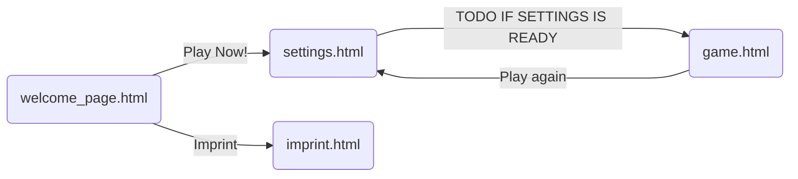

# Übersicht
Das ChessDestroyer-Projekt ist eine Webanwendung, die es einem Nutzer ermöglicht gegen eine Stockfish Chess Engine mit verschiedenen Schwierigkeitsstufen zu spielen. Gewinnt ein Spieler in einer Runde, wird er zudem noch mit einem Score bewertet und in ein persistentes Scoreboard eingetragen.
# Struktur des Projektes
Die Aufgaben innerhalb der Webanwendung werden strikt zwischen dem Backend und dem Frontend aufgeteilt und wobei das Backend alle Angaben des Frontends nach dem __Zero-Trust Prinzip__ validiert.
# Frontend
## Technologien
Das Frontend bassiert auf zwei Javascript frameworks:
- Chessboard.js v2
   - Ist für das bereitstellen des Schachbrettes verantwortlich und generiert sowohl das Brett an sich als auch die Figuren.
   - Chessboard.js stellt schnittstellen bereit, um eine Aufstellung aus einem String zu laden und die einzelnen Figuren zu bewegen.
   - Auch Callbacks für Nutzereingaben werden Bereitgestellt, so dass das Auslesen von angeklickten Feldern einfacher wird.
   - Chessboard.js enthält keinerlei Spiellogik, auf dem Brett könnte im grunde alles angezeigt werden.
- Chess.js
   - Benutzen wir um im Frontend bereits die Schachlogik bereitstellen zu können.
   - Wir benutzen Chess.js hauptsächlich um Züge zu validieren oder um zu erkennen, ob und wie ein Spiel beendet wurde (Schachmatt oder Unentschieden).

## Unterseiten
Das komplette Projekt besteht lediglich aus 4 Unterseiten (3 Seiten + Impressum).
Da die verknüpfungen der Seiten schwierig textuell zu beschreiben sind, haben wir dieses Diagramm erstellt.


Der Nutzer Startet auf der `welcome_page.html`. Hier befinden sich allgemeine Informationen, was den Nutzer auf den Nächsten Seiten erwartet und worauf er genau geklickt hat. Von `welcome_page.html` aus kann der Nutzer über das Menü und den Button "Imprint" zu `imprint.html` gelangen. Alternativ kann er ausgehend von der `welcome_page.html` mit dem Button "Play Now!" auch auf die `settings.html` gelangen.
Die `settings.html` Unterseite gibt dem Nutzer die Möglichkeit, seinen Nutzernamen (Der später auch auf dem Scoreboard landet), die Schwierigkeit des Computergegners und die Figurenfarbe (Schwarz / Weis / Zufällig) anzupassen. Über den Button ==TODO IF SETTINGS IS READY== gelangt der Nutzer schlussendlich auf die `game.html` Seite. Hier findet das eigentliche Spiel statt. Nach einem beendeten Spiel kann mit dem Button "Play again" zurück zur `settings.html` navigiert werden, um ein neues Spiel zu starten.

## Frontend Design

### welcome_page.html
Die Landing Page für die Webanwendung "Chessdestroyer 4000" bietet eine kurze Einführung in das Produkt, hebt seine Hauptmerkmale hervor und bietet einfache Navigationselemente sowie eine Schaltfläche zum Starten des Spiels.\
#### Wichtige Features
- Durch das Meta-Viewport-Tag und die externe CSS-Datei ist die Seite auf verschiedene Bildschirmgrößen angepasst.
- Ein Formular mit einer Schaltfläche zum Starten des Spiels, das den Benutzer zur Seite "settings.html" führt.
- Multimedia: Ein Hintergrundvideo, das der Seite ein dynamisches und ansprechendes Aussehen verleiht.

### settings.html
Die Einstellungsseite ermöglicht es Benutzern, ihre Spielerinformationen und -präferenzen festzulegen, bevor sie ein neues Spiel starten.
- Verstecktes Feld: Enthält ein verstecktes Eingabefeld (hidden), um eine neue Sitzung zu kennzeichnen.
- Benutzernamen-Feld: Ein Eingabefeld für den Benutzernamen (username), das erforderlich ist und auf 20 Zeichen begrenzt ist.  
- Schwierigkeitsgrad: Ein Schieberegler (range) für die Auswahl des Schwierigkeitsgrads mit einem Bereich von 1 bis 3, wobei der aktuelle Wert angezeigt wird.  
- Farbauswahl: Radiobuttons für die Auswahl der Spielerfarbe (Weiß, Zufällig, Schwarz).
- Absenden: Eine Schaltfläche zum Absenden des Formulars und Starten des Spiels.

### imprint.html
Die Seite stellt eine rechtskonforme Impressumsseite für die Chessdestroyer 4000 Webanwendung bereit, die den Nutzern alle erforderlichen rechtlichen Informationen und Kontaktmöglichkeiten bietet.

### game.html
Um das Spiel Layout einfacher auf mobilgeräte anpassen zu können, wird hier ein Gridlayout mit einem 2X3 Grid verwendet. Das Spielbrett nimmt ein 2X2 Felder ein, die Beschreibung von Spieler und Gegner jeweils 1 Feld. Um Das Spiel effektiv Centern zu können, besitzt das Grid zwei Parent divs.
Neben dem Spielfeld besteht die Website noch aus dem `game-over-container`. Dieser ist beim laden der Seite verborgen und wird erst später durch javascript sichtbar gesetzt. Auch im `game-over-container` befindet sich die gleiche struktur um den inhalt zu Centern. Des weiteren enthält der `game-over-container` noch den "Game Over" Schriftzug, einen link Button um zurück zur `settings.html` seite gelangen zu können und zwei Platzhalter, einen für die `over-description` und einen für das Scoreboard, welches ebenfalls durch Javascript eingefügt wird.


## Frontend Logik
Die gesamte Logik des Frontends spielt sich in der game.html.hbs datei ab, hier ist das eigentliche Schach Spiel implementiert. Somit ist der Nutzer die meiste Zeit auf der game.html.hbs seite.

### Handlebars
Beim Rendern der Handlebars setzt da Backend bereits drei Variablen in das Frontend ein:

| Name       | Nutzen                                                                                                                                                                                                                                                                                                                       |
|------------|------------------------------------------------------------------------------------------------------------------------------------------------------------------------------------------------------------------------------------------------------------------------------------------------------------------------------|
| username   | Durch das einfügen des Nutzernamens ist sichergestellt, dass das Frontend und Backend den gleichen Nutzernamen führen. Dies ist für die Korrektheit des Scoreboard wichtig.                                                                                                                                                  |
| difficulty | Die Schwierigkeit wird im Backend rein durch Zahlen abgebildet. Dass der Nutzer trotzdem auch während des Spiels die Möglichkeit hat, die Schwierigkeit einzustufen, wird ihm im Frontend eine Lesbare Schwierigkeit angezeigt.                                                                                              |
| color      | Da wir nach dem Zero-Trust Prinzip vorgehen, wird bei auswahl einer Zufälligen Farbe, eben diese Farbe im Backend generiert. Da die spiel logik des Frontends allerdings auch eine Spieler farbe benötigt, wird diese per handelbar in ein hidden input Feld gerendert, wo sie per javascript später ausgelesen werden kann. |


### Funktionen
Im Wesentlichen besteht die Logik des Frontend aus den folgenden Funktionen:

| Fuktionsname               | Beschreibung                                                                                                                                                                                                                                                                                                                                                                                                                                                                                                                                                                                                                                                                                                                         |
|----------------------------|--------------------------------------------------------------------------------------------------------------------------------------------------------------------------------------------------------------------------------------------------------------------------------------------------------------------------------------------------------------------------------------------------------------------------------------------------------------------------------------------------------------------------------------------------------------------------------------------------------------------------------------------------------------------------------------------------------------------------------------|
| isPiecePlayerColor (piece) | Überprüft mittels REGEX ob die Farbe der Figur (pice) der Farbe des spielers entspricht                                                                                                                                                                                                                                                                                                                                                                                                                                                                                                                                                                                                                                              |
| onDragStart (dragStartEvt) | Wird von Chessboard.js aufgerufen, sobald ein Spieler versucht eine Figur zu bewegen.<br/> 1. Zuerst wird die Funktion `isPiecePlayerColor()` aufgerufen, danach `Chess.js` konsultiert, ob der Spieler am Zug ist.<br/> 2. Nur wenn beide Abfragen erfolgreich sind, darf der Spieler die Figur bewegen.<br/> 3. Außerdem werden mithilfe von `Chess.js` alle legalen züge der Figur generiert.<br/> 4. Über die Erlaubten züge wird iteriert und auf jedes Zielfeld eines Zuges ein Kreis gesetzt.                                                                                                                                                                                                                                 |
| onDrop (dropEvt)           | Wird von Chessboard.js aufgerufen, sobald ein Spieler versucht eine Figur auf ein neues Feld gezogen und losgelassen hat. <br/>1. Der Zug wird an `Chess.js` weitergereicht, das Ergebnis des Zuges wird für später gespeichert. <br/>2. Alle Punkte (welche zuvor durch `onDragStart` gesetzt wurden, werden gelöscht.<br/> 3. Nun wird das zuvor gespeicherte Ergebnis von `Chess.js` überprüft.<br/> 4a. Falls der Zug nicht erlaubt war, wird die Figur auf das Ursprüngliche Feld zurückgesetzt. <br/> 4b. Falls der Zug erlaubt war, wird das Schachbrett auf die Aktuelle Position gesetzt. <br/> 5b. Die Funktion `opponentMove(dropEvt.source, dropEvt.target);` wird aufgerufen. <br/> 6b. Die Funktion `checkGameOver();` |
| fetchBoard(src, dest)      | Schickt die src und dest Felder and das Backend.                                                                                                                                                                                                                                                                                                                                                                                                                                                                                                                                                                                                                                                                                     |
| checkGameOver()            | Ist Relativ selbsterklärend, `Chess.js`wird Konsultiert, ob das Spiel beendet wurde.<br/>Wenn laut `Chess.js` das Spiel Beendet wurde, wird das Backend konsultiert, ob das Spiel auch im backend beendet ist. Dieses Verfahren ist teil unseres Zero-Trust Prinzips <br/> Falls das Spiel im Backend nicht beendet ist, wird der aktuelle Spielstand mit dem Stand aus dem Backend überschrieben. <br/> Wenn sich das Backend und `Chess.js` einig sind, wird der "game-over-container" sichtbar gesetzt und sperrt somit das Spielfeld. Außerdem wird der Gewinner in die Beschreibung des Game Over Popup eingefügt.<br/> Bei Jedem Aufruf der `checkGameOver()` Funktion wird auch die `highlightTurn()` Funktion aufgerufen.    |
| opponentMove(src, dest)    | Stellt zuerst sicher, dass wirklich der Gegner am Zug ist. Dann wird: <br/> 1. Die Funktion `fetchBoard` wird aufgerufen, der Zug des Backends mit `Chess.js` synchronisiert und das Board auf die aktuelle Position gesetzt.<br/> 2. Die Funktion `checkGameOver()` wird ausgeführt.                                                                                                                                                                                                                                                                                                                                                                                                                                                |
| highlightTurn()            | Setzt die Deckkraft des Spieler namens, welcher aktuell am Zug ist auf 100% während die Deckkraft des nicht aktiven Spieler namens auf 50% Reduziert wird.<br/> Außerdem wird von `Chess.js`berechnet, ob aktuell ein Spieler im Schach steht. Sollte dies der Fall sein, wird das Feld auf dem der Betroffene König steht Rot eingefärbt.                                                                                                                                                                                                                                                                                                                                                                                           |
| firstMove()                | Zuerst wird die Funktion `highlightTurn()` aufgerufen. <br/>Falls die Farbe des Menschlichen Spielers Schwarz ist, wird dann ein erste Zug aus dem Backend angefordert mit dem Aufruf `opponentMove(0, 0).                                                                                                                                                                                                                                                                                                                                                                                                                                                                                                                           |

### Ablauf
Ablauf der Frontend Logik, nachdem die Website fertig geladen ist (Dies passiert ohne Interaktion):
1. Einlesen der color, welche zuvor mit Handlebars gesetzt wurde.
2. Erstellen einer Instanz von `Chess.js` in Startaufstellung.
3. Erstellen des Schachboards mit `Chessboard.js`, die Ausrichtung wird von der zuvor eingelesenen color angegeben und die Aufstellung aus der `Chess.js` Instanz übernommen.
4. Die Funktion `firstMove()` wird ausgeführt:
   1. Die Funktion`highlightTurn()` wird ausgeführt und highlightet im UI den Spieler der aktuell am Zug ist.
   2. Falls der Spieler die Figurenfarbe Schwarz hat, wird die Funktion `opponentMove("0", "0")` aufgerufen.

# Backend
Der _Quellcode des Backends_ befindet sich im [```src```](https://github.com/BaitAPI/ChessDestroyer/tree/7eb3514b16b418835f2e9bf7d1071cefaa3fc785/src) Verzeichnis des Projekts. Der __Einstiegspunkt__ ist hierbei die [```main.rs```](https://github.com/BaitAPI/ChessDestroyer/blob/7eb3514b16b418835f2e9bf7d1071cefaa3fc785/src/main.rs) mit der Funktion [```rocket```](https://github.com/BaitAPI/ChessDestroyer/blob/7eb3514b16b418835f2e9bf7d1071cefaa3fc785/src/main.rs#L128).
Die [```Cargo.toml```](https://github.com/BaitAPI/ChessDestroyer/blob/7eb3514b16b418835f2e9bf7d1071cefaa3fc785/Cargo.toml) im Root-Verzeichnis gibt die __Abhängigkeiten__ des Projektes an und wird von [__cargo__](https://doc.rust-lang.org/nightly/nightly-rustc/cargo/) (dem Package-Manager von Rust) benötigt.
## Verwendete Technologien
Für das Backend der Webanwendung wurde [__Rust__](https://www.rust-lang.org/) in Kombination mit dem [__Rocket Framework__](https://rocket.rs/) ausgewählt. Diese Entscheidung resultierte aus den spezifischen Anforderungen des Projekts, in dem die Anwendung äußerst _robust_ sein und eine ausgezeichnete Fehlerbehandlung bieten sollte. Zudem war es wichtig, zu verhindern, dass bei fehlerhaften Serveranfragen _Laufzeitfehler_ entstehen.\
__Rust__, als _typensichere Programmiersprache_ mit _hervorragender Fehlerbehandlung_, wurde als ideal geeignet betrachtet. Das __Rocket Framework__ überzeugte durch seine _einfache Syntax_, die eine schnelle Implementierung eines Webservers ermöglicht. Darüber hinaus unterstützt es nativ die _asynchrone Anfragenverarbeitung_ und bietet eine sehr gute _Laufzeitperformance_. Das Konzept der _mountable applications_ erleichtert die Unterteilung der Anwendung in Komponenten, was die _Integration neuer Funktionen_, wie zum Beispiel des dynamisches HTML-Rendering, erheblich vereinfacht und entsprechend effizient umsetzt.\
Für die _Verwaltung_ und _Durchführung_ des Schachspiels wurde die [__Shakmaty__](https://docs.rs/shakmaty/latest/shakmaty/) Bibliothek eingesetzt. Diese Bibliothek übernimmt die gesamte Spielverwaltung und sorgt für eine reibungslose Handhabung. Ein wichtiges Merkmal dieser Bibliothek ist die _Kompatibilität_ mit dem _UCI_ (Universal Chess Interface) und der _FEN_ (Forsyth-Edwards Notation), was eine einfache Kommunikation mit der Stockfish-Instanz und eine _minimale_ und zugleich _genormte Darstellung_ des Schachbrettzustandes ermöglicht.\
Für die _persistente Speicherung_ des Scoreboards und das gleichzeitige Durchführen von _Änderungen aus einem asynchronen Kontext_ ohne das Auftreten von race conditions wurde die [__Rusqlite__](https://docs.rs/rusqlite/latest/rusqlite/) Bibliothek verwendet. Diese _basiert auf SQLite_ und ermöglicht eine effiziente Fehlerbehandlung, wobei die Vorteile einer SQLite-basierten Datenbank voll zum Tragen kommen.
## Routen und Aufbau
### Aufbau
Im Rahmen der _Instanziierung des Webservers_ mit der Funktion [`rocket`](https://github.com/BaitAPI/ChessDestroyer/blob/7eb3514b16b418835f2e9bf7d1071cefaa3fc785/src/main.rs#L128), werden zunächst mehrere Objekte generiert, die als __Zustände__ in das Rocket Framework übergeben werden. Dabei wird ein [```SessionHandler```](https://github.com/BaitAPI/ChessDestroyer/blob/7eb3514b16b418835f2e9bf7d1071cefaa3fc785/src/main.rs#L130) erstellt, welcher `Game` Instanzen speichert und diese einem Client durch später platzierte SessionId-Cookies zuordnet. Zudem wird ein [```DB```](https://github.com/BaitAPI/ChessDestroyer/blob/7eb3514b16b418835f2e9bf7d1071cefaa3fc785/src/main.rs#L132) Objekt, als Verbindung zur persistenten rusqlite Datenbank, generiert und ebenfalls an das Rocket Framework übergeben.
### Routen
Der Webserver unterstützt _fünf explizit definierte Routen_ sowie eine Route für die _statische Dateibereitstellung_. Die Funktionen der einzelnen Routen werden im Folgenden genauer erläutert:
1) [GET /](https://github.com/BaitAPI/ChessDestroyer/blob/7eb3514b16b418835f2e9bf7d1071cefaa3fc785/src/main.rs#L28) \
   Diese Route wird normalerweise als erste aufgerufen und _leitet die Anfrage_ des Clients _permanent_ an die ```welcome_page.html``` weiter.
2) [POST /game](https://github.com/BaitAPI/ChessDestroyer/blob/7eb3514b16b418835f2e9bf7d1071cefaa3fc785/src/main.rs#L36) \
   Diese Route wird üblicherweise über das Formular der ```settings.html``` aufgerufen und dient der _Erstellung eines Spieles_.\
   Sie muss folgende __Parameter__ beinhalten:
   - ```new_session```: Option\
     Ein _optionaler Parameter_, der angibt, ob eine möglicherweise laufende Sitzung überschrieben werden soll.
   - ```username```: String\
     Der _Nutzername des Spielers_, der unter anderem für den Scoreboard-Eintrag genutzt wird.
   - ```difficulty```: Integer $\in\{1,2,3\}$\
     Eine Zahl die die vom Spieler _gewählte Schwierigkeitsstufe_ angibt.
   - ```color```: Character $\in \{w,b,r\}$\
     Ein Textzeichen, welches die vom Spieler _gewählte Farbe_ oder $r$ für eine zufällige Farbe angibt.

   Anfangs überprüft die Route mit `find_session`, ob der Client bereits eine Sitzung hat. Existiert diese und ist der `new_session` Parameter gesetzt, wird diese gelöscht.\
   Dann wird ein _neues Spiel_ mit den vorgegebenen Parametern _generiert_. Dabei wird über die `Game`-Instanz unter anderem ein Unterprozess der Stockfish-Instanz erstellt.\
   Ist das _Spiel erfolgreich erstellt_ worden, wird anschließend eine neue Sitzung, die mit der `Game`-Instanz verknüpft ist, erstellt und im `SessionHandler` gespeichert.\
   Schließlich wird die ```game.html``` über Handlebars _generiert und als Antwort zurückgegeben_, wobei wichtige Informationen, wie die Spielerfarbe und der Nutzername, in das HTML eingefügt werden.
3) [POST /move](https://github.com/BaitAPI/ChessDestroyer/blob/7eb3514b16b418835f2e9bf7d1071cefaa3fc785/src/main.rs#L92) \
   Diese Route wird während eines Spiels wiederholt von der ```game.html``` aufgerufen, um einen vom Spieler _ausgeführten Zug zu validieren_ und den entsprechenden _Gegenzug der Stockfish-Engine_ zu ermitteln.\
   Die Anfrage muss folgenden __Body__ haben:
   - ```move```: String
     Ein vierstelliger String, der den _Zug_ beschreibt. Die ersten zwei Zeichen bezeichnen das Quellfeld des Zuges, die letzten beiden das Zielfeld

   Zunächst wird überprüft, ob der anfordernde Client überhaupt eine Session besitzt. Ist dies der Fall, wird die zugehörige _Spielsitzung geladen_ und der _Zug des Spielers validiert und ausgeführt_.\
   Sollte der _Zug ungültig_ sein, wird der letzte _Schachbrettzustand als FEN_ mit einem _406-Statuscode_ zurück an den Client gesendet, um eine Fortsetzung des Spiels mit einem validierten Schachbrett zu ermöglichen.\
   Im weiteren Verlauf berechnet und vollzieht die _Stockfish-Engine_, die der `Game`-Instanz zugeordnet ist, den _Gegenzug_. Der _neue Schachbrettzustand_ wird dann als FEN mit einem _positiven Statuscode_ zurückgegeben.
4) [GET /game_end](https://github.com/BaitAPI/ChessDestroyer/blob/7eb3514b16b418835f2e9bf7d1071cefaa3fc785/src/main.rs#L64) \
   Der Aufruf dieser Route erfolgt, wenn der _Client_ auf der ```game.html``` _vermutet_, dass das _Spiel beendet_ ist.<br/>
   Die _Route überprüft_, ob das Spiel tatsächlich beendet ist. Im Fall, dass das Spiel beendet ist, wird ein _200er-Statuscode_ zurückgegeben. Andernfalls wird mit dem _Statuscode 406_ der _letzte Spielzustand als FEN_ zurückgesendet.
5) [GET /scoreboard](https://github.com/BaitAPI/ChessDestroyer/blob/7eb3514b16b418835f2e9bf7d1071cefaa3fc785/src/main.rs#L117) \
   Der Aufruf dieser Route erfolgt, sobald ein _Spiel beendet_ ist und das _Scoreboard_ geladen werden soll.\
   Sie muss folgenden __Parameter__ beinhalten:
   - ```count```: int\
     Ein _optionaler Parameter_, der die _Anzahl der Scoreboard-Einträge_, die geladen werden sollen, angibt.

   Diese Route öffnet über den ```DB``` Zustand eine _Verbindung zur Datenbank_ und gibt die entsprechenden Einträge, sofern vorhanden, aus. Sie werden als _Liste im JSON-Format_ an den Client übermittelt.
6) [GET /<document_name>](https://github.com/BaitAPI/ChessDestroyer/blob/7eb3514b16b418835f2e9bf7d1071cefaa3fc785/src/main.rs#L139) \
   Der Aufruf dieser Route dient dazu, alle _statischen Ressourcen bereitzustellen_, die im Ordner ```static``` vorliegen. Sie wird über den ```FileServer``` instanziiert.\
   Über diese Route werden insbesondere die ```welcome_page.html```, die ```settings.html```, die ```impressum.html``` sowie die zugehörigen CSS- und JS-Dateien bereitgestellt.
